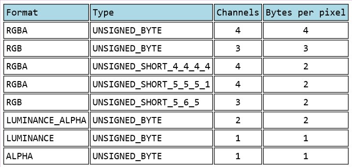
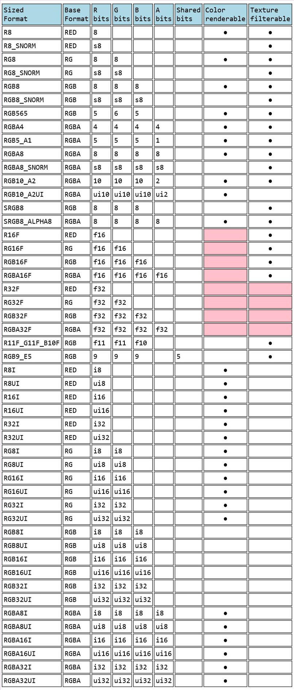

# apply texture

we apply textures in these steps: 

1. change vertex shader, create a varying to pass v_textureCoord to fragment shader

2. in fragment shader, use an uniform variable to get texture2D

3. in gl program:

Create and Bind Texture -->> fill texture with a kind of color or an image -->> use that texture

We can use textures directly, even though we never have gotten the texture2D uniform variable specified in the fragment shader.

texture use (s, t, u, v), but *what we usually used for 2D textures is called (u, v), not (s, t)*

```javascript 
function initTexture () {
  // create and bind a texture
  let texture = gl.createTexture()
  gl.bindTexture(gl.TEXTURE_2D, texture)
  
  // fill the texture with a default color
  gl.texImage2D(gl.TEXTURE_2D, 0, gl.RGBA, 1, 1, 0, gl.RGBA, gl.UNSIGNED_BYTE, new Uint8Array([0, 0, 255, 255]))

  // async load an image
  let image = new Image()
  image.src = 'http://127.0.0.1:9000/img/tx_bet.png'
  image.crossOrigin = 'anonymous'
  image.onload = function () {
    gl.bindTexture(gl.TEXTURE_2D, texture)
    gl.texImage2D(gl.TEXTURE_2D, 0, gl.RGBA, gl.RGBA, gl.UNSIGNED_BYTE, image)
    gl.generateMipmap(gl.TEXTURE_2D)
  }
}
```

## image cors

we should set `Access-Control-Allow-Origin: "*"` in the back end.

we need specify `image.crossOrigin = 'anonymous'`, or a DOMException may raise.
(we not only take this image for watch, but we need its pixel information, that need crossorigin)

## generateMipmap

when we take a 16\*16 image and draw on 2\*2 plain, what photoshop do is average the 4 equalent zone in the original image, but it's very slow in GPU, so what the GPU does is it uses a mipmap

A mipmap is a collection of progressively smaller images, each one 1/4th the size of the previous one

`gl.generateMipmap(gl.TEXTURE_2D)` we gen bitmap for the texture, that need 1/3 more memory space (it create 1*1, 2*2, 4*4, 8*8, ..., sqrt(a)*sqrt(a))


## texture atalas

we merge some small pictures in a big image, and can get then through texture coordinate.

## texture settings

```javascript
// repeat in x axis, such as REPEAT, CLAMP_TO_EDGE, MIRROR_REPEAT
gl.texParameteri(gl.TEXTURE_2D, gl.TEXTURE_WRAP_S, gl.CLAMP_TO_EDGE);
// repeat in y axis
gl.texParameteri(gl.TEXTURE_2D, gl.TEXTURE_WRAP_T, gl.CLAMP_TO_EDGE);
// filters (view filter.jpg)
gl.texParameteri(gl.TEXTURE_2D, gl.TEXTURE_MIN_FILTER, s.filter);
gl.texParameteri(gl.TEXTURE_2D, gl.TEXTURE_MAG_FILTER, gl.LINEAR);
```

`TEXTURE_MIN_FILTER` is the setting used when the size you are drawing is smaller than the largest mip. TEXTURE_MAG_FILTER is the setting used when the size you are drawing is larger than the largest mip. For `TEXTURE_MAG_FILTER` only NEAREST and LINEAR are valid settings.

## texture units

how does the shader know which texture to use for someTexture?

```javascript
/* pseudo code start */
const gl = {
  activeTextureUnit: 0,
  textureUnits: [
    // null is not null itself, but a texture contains null data
    { TEXTURE_2D: null, TEXTURE_CUBE_MAP: null, TEXTURE_3D: null, TEXTURE_2D_ARRAY: null, },
    { TEXTURE_2D: null, TEXTURE_CUBE_MAP: null, TEXTURE_3D: null, TEXTURE_2D_ARRAY: null, },
    { TEXTURE_2D: null, TEXTURE_CUBE_MAP: null, TEXTURE_3D: null, TEXTURE_2D_ARRAY: null, },
    { TEXTURE_2D: null, TEXTURE_CUBE_MAP: null, TEXTURE_3D: null, TEXTURE_2D_ARRAY: null, },
    { TEXTURE_2D: null, TEXTURE_CUBE_MAP: null, TEXTURE_3D: null, TEXTURE_2D_ARRAY: null, },
    { TEXTURE_2D: null, TEXTURE_CUBE_MAP: null, TEXTURE_3D: null, TEXTURE_2D_ARRAY: null, },
    { TEXTURE_2D: null, TEXTURE_CUBE_MAP: null, TEXTURE_3D: null, TEXTURE_2D_ARRAY: null, },
    { TEXTURE_2D: null, TEXTURE_CUBE_MAP: null, TEXTURE_3D: null, TEXTURE_2D_ARRAY: null, },
    { TEXTURE_2D: null, TEXTURE_CUBE_MAP: null, TEXTURE_3D: null, TEXTURE_2D_ARRAY: null, },
    ...
  ],
  activeTexture: function (index) {
    this.activeTextureUnit = index - gl.TEXTURE0
  },
  bindTexture: function (TARGETNAME, texture) {
    this.textureUnits[activeTextureUnit][TARGETNAME] = texture
  }
}
/* pseudo code end */

// active a unit
// at init time
const indexOfTextureUnit = 5;
const ourTexture = gl.createTexture();
// insert code it init texture here.
 
...
 
// at render time
gl.activeTexture(gl.TEXTURE0 + indexOfTextureUnit);
gl.bindTexture(gl.TEXTURE_2D, ourTexture);

// max number of textures supported, at least 32
gl.getParameter(gl.MAX_COMBINED_TEXTURE_IMAGE_UNITS); // 32
// different shaders have different number
gl.getParameter(gl.MAX_VERTEX_TEXTURE_IMAGE_UNITS); // 16
gl.getParameter(gl.MAX_TEXTURE_IMAGE_UNITS); // 16
```

## data texture --- inner format and type

This map is just a format-type information:



We can see more detail here, with bit and channel information



And then, then `inner type` -- `type` -- `javascript data type` map


