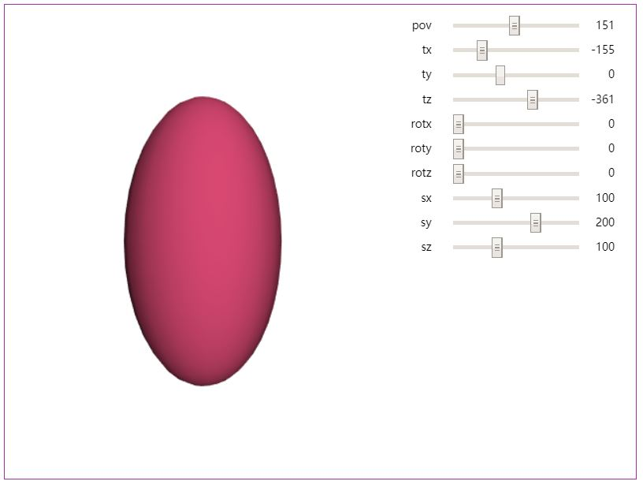

## lighting, directional lighting

directional light is simple

follow the following steps:

1. get the normal direction of all surfaces (put them on vertices)

2. choose a light direction

3. in vertex shader -->> pass v_normal direction to framgent shader

   in fragment shader -->> get u_reverseLightDirection and v_normal
                           calc dot(light * normal)
                           use (u_color.rgb *= dot_result) as the final color

**Attention: we should always use normalized vector in lighting.**

4. set a world matrix (the same as the object) for light, not including translation, because translation means nothing for vectors.

## including scale

the u_world matrix should be an invert transposed matrix of the world matrix, which in formula:

<em>u_matrix</em> = (<strong>M</strong>-1)T

`worldMatrix = m4mul(rotationZ, rotationY, rotationX)`

`worldMatrix = m4.transpose(m4unit(), m4.invert(m4unit(), m4mul(scale, rotationZ, rotationY, rotationX)))`

